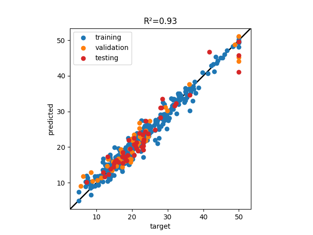

# Pygmalion

Pygmalion in the greek mythologie is a sculptor that fell in love with one of his creations.
In the myth, Aphrodite gives life to Galatea, the sculpture he fell in love with.

This package is a machine learning library. It contains all the tools you need to give a mind of their own to inanimate objects.

## installing pygmalion

pygmalion can be installed through pip.

~~~
pip install pygmalion
~~~

## Fast prototyping with pygmalion

Architectures for several common machine learning tasks are implemented in this package.
The inputs and outputs of the model are common python object (such as numpy array and pandas dataframes)

You can download a dataset and split it with the **split** function.

~~~python
>>> import pygmalion as ml
>>> import pygmalion.neural_networks as nn
>>> import pandas as pd
>>> import matplotlib.pyplot as plt
>>> ml.datasets.boston_housing("./")
>>> df = pd.read_csv("./boston_housing.csv")
>>> x, y = df[[c for c in df.columns if c != "medv"]], df["medv"]
>>> data, test_data = ml.split((x, y), frac=0.1)
>>> train_data, val_data = ml.split(data, frac=0.1)
~~~

Creating and training a model is done in a few lines.

~~~python
>>> hidden_layers = [{"channels": 8}, {"channels": 8}]
>>> model = nn.DenseRegressor(x.columns, hidden_layers, learning_rate=1.0E-3, GPU=False)
>>> model.train(train_data, val_data, n_epochs=1000, patience=100)
~~~

Some usefull metric can easily be evaluated/displayed.

~~~python
>>> f, ax = plt.subplots()
>>> x_train, y_train = train_data
>>> ml.plot_correlation(model(x_train), y_train, ax=ax, label="training")
>>> x_val, y_val = val_data
>>> ml.plot_correlation(model(x_val), y_val, ax=ax, label="validation")
>>> x_test, y_test = test_data
>>> ml.plot_correlation(model(x_test), y_test, ax=ax, label="testing")
>>> ax.set_title(f"R²={ml.R2(model(x_test), y_test):.3g}")
>>> plt.show()
~~~

All the models can be be saved to the disk in json format with the **save** method.
A model saved on the disk can then be loaded back with the **load** class method.

~~~python
>>> import numpy as np
>>> model.save("./model.json")
>>> y1 = model(x)
>>> model = nn.DenseRegressor.load("./model.json")
>>> y2 = model(x)
>>> print(np.allclose(y1 - y2))
~~~

The model state can be dumped as a dictionnary through the **dump** property. A copy of the model can be loaded with the 

~~~python
>>> dump = model.dump
>>> model = nn.DenseRegressor.from_dump(dump)
~~~

## Implemented models

### Neural networks

The neural network models all share some common attributes:

* The **module** attribute is the underlying pytorch Module object.
* The **GPU** attribute is a boolean defining if the model must be evaluated on CPU or GPU.
* The **norm_update_factor** attribute is the factor used to update the batch normalization running mean and variance.
* The **learning_rate** attribute is the learning rate used during training.
* The **optimization_method** attributes is the string name of the torch.optim optimizer used during training.
* The **L1**/**L2** attribute is the L1/L2 penalization factor used during training.
* The **residuals** attribute is a dict containing the training and validation loss.

The history of the loss can be plotted using the **plot_residuals** method.

~~~python
>>> model.train(training_data, validation_data=validation_data,
>>>             n_epochs=1000, patience=100)
>>> model.plot_residuals()
>>> plt.show()
~~~

The black line represents the epoch for which the validation loss was the lowest. At each epoch the state of the model is saved if the validation loss has improved. The training stops when the model trained for **n_epochs**, or when the validation loss has not improved for **patience** epochs. After what the last saved state is loaded.

The **train** method is used to train the neural networks model. It can be called several times and will restart from where it stopped. The **train** methods takes one argument: **training_data**, which must be a tuple of (x, y) or (x, y, weight) for weighted observations. The types of x/y/weights depends on the model types.

1. **DenseRegressor**

A dense regressor (or multi layer perceptron regressor) predicts a scalar value given an input of several variables.
This implementation takes in input a dataframe of numerical observations, and predict a numpy array of the same length.

It is implemented as a sucession of hidden **Activated0d** layers (linear weighting/non linear activation/batch normalization) and a final linear weighting.

2. **DenseClassifier**

A dense classifier is a 

3. **ImageClassifier**

4. **SemanticSegmenter**

